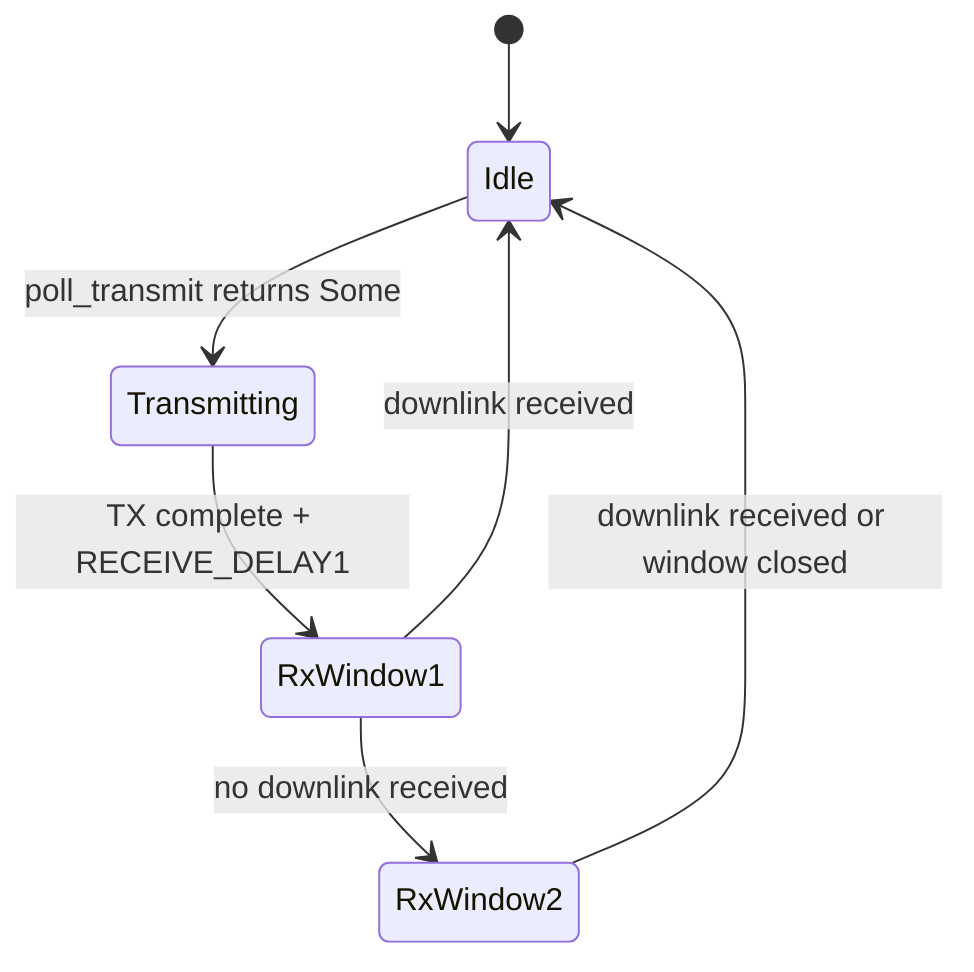

# theatron — Architecture Proposal

## Project Goal

theatron is a simulation and evaluation framework that models network-level effects (propagation, interference, contention, adversarial scenarios) to compare protocol implementations under controlled, reproducible conditions. Protocol implementations are external. Any `Protocol` trait implementor can be evaluated — different protocols, different implementations of the same protocol, same implementation with different parameters. LoRaWAN via lora-rs is the first validation target. Outputs help clients with stack selection and inform protocol development outside theatron.

## Evaluation Dimensions

theatron targets multiple dimensions of protocol evaluation:

- **Performance under interference**: throughput vs spreading factor, saturated band scenarios, co-channel contention
- **Parameter optimization**: SF, bandwidth, coding rate, and TX power tradeoffs
- **Scalability**: throughput and latency degradation as node count grows
- **Reliability**: packet delivery ratio, retransmission overhead, protocol-specific session establishment metrics (e.g. join success rate in LoRaWAN)
- **Energy efficiency**: time-on-air as a proxy for battery impact
- **Security and resilience**: adversarial scenarios including replay attacks, jamming, band flooding, and eavesdropping; adversaries may be external or internal (compromised nodes)

## Core Abstractions

### `Protocol` trait

The central abstraction. Each MAC protocol implements this trait, which defines how a node processes received frames, generates transmissions, and manages state.

```rust
trait Protocol {
    type Config;
    type State;
    type Metrics;

    fn init(&self, config: Self::Config) -> (Self::State, Option<SimTime>);
    fn on_receive(&self, state: &mut Self::State, frame: RxMetadata, time: SimTime) -> Option<SimTime>;
    fn poll_transmit(&self, state: &mut Self::State, time: SimTime) -> Option<Transmission>;
    fn update(&self, state: &mut Self::State, time: SimTime) -> Option<SimTime>;
    fn metrics(&self, state: &Self::State) -> Self::Metrics;
}

struct RxMetadata {
    payload: Vec<u8>,
    rssi: f32,
    snr: f32,
    sf: u8,
    time: SimTime,
}

struct Transmission {
    payload: Vec<u8>,
    sf: u8,
    bandwidth: u32,
    coding_rate: u8,
    frequency: u32,
}
```

`init`, `on_receive`, and `update` each return `Option<SimTime>` — the next simulation time at which the scheduler must call `update` on this node. Returning `None` means the node has no pending timer. This allows the scheduler to use event-driven dispatch (a priority queue keyed on SimTime) rather than polling every node on every tick.

`update` drives timer-based state transitions (e.g. RX1/RX2 window opening in LoRaWAN Class A) without requiring an incoming frame.

#### Two ways external protocol implementations connect to theatron

**Adapter integration**: a thin adapter wraps an external crate (e.g. `lorawan-device`). Protocol logic stays entirely in the external crate; the adapter implements the `Protocol` trait to bridge it into the simulation.

**Direct trait implementation**: a protocol implemented externally against the `Protocol` trait directly, for protocols without an existing crate.

#### Recommended pattern for external implementors: static state machine validation

For protocols implemented directly against the `Protocol` trait, the typestate pattern can encode valid state transitions at the type level:

```rust
struct Idle;
struct Transmitting { started: SimTime }
struct RxWindow1 { tx_end: SimTime }

impl Protocol for MyProtocol<Idle> { ... }
impl Protocol for MyProtocol<Transmitting> { ... }
impl Protocol for MyProtocol<RxWindow1> { ... }
```

Invalid transitions become compile errors. For adapter integrations, correctness comes from the upstream crate's own state machine.

#### LoRaWAN Class A state flow (validation target reference)

The following illustrates the validation target's state machine for reference:



### `TrafficModel` trait

LoRaWAN and similar protocols do not transmit autonomously — the application layer decides when to send data. A `TrafficModel` provides uplink payloads to a node when it is ready to transmit.

```rust
trait TrafficModel {
    fn next_payload(&mut self, time: SimTime) -> Option<Vec<u8>>;
}
```

The scheduler calls `poll_transmit` on the protocol; the protocol (or its adapter) calls `next_payload` on the traffic model to get application data. Built-in models: periodic, Poisson arrival, bursty. Custom models can be provided for application-specific load patterns.

### Validation Target: LoRaWAN via lora-rs

LoRaWAN via lora-rs is the first real-world protocol used to prove the simulation engine works with a real stack. The validation example is external to theatron core and comprises three components:

- **LoRaWAN device adapter**: wraps `lorawan-device::nb_device` to implement the `Protocol` trait
- **Simulated network server**: responds to joins and schedules downlinks (see below)
- **SimulatedRadio**: bridges the adapter to theatron's channel

The validation example uses:

- **`lorawan`**: frame parsing and creation, MIC verification, MAC command handling. `RxMetadata.payload` and `Transmission.payload` are raw bytes parsed via `lorawan::parser::PhyPayload`.
- **`lorawan-device`**: real Class A state machine via `nb_device`. The adapter drives it by implementing `lorawan_device::nb_device::radio::PhyRxTx` on a `SimulatedRadio` struct that bridges to the simulated channel.
- **`lora-modulation`**: SF, bandwidth, and time-on-air calculations. Used in the channel model and energy-efficiency metrics.

#### `nb_device::radio::PhyRxTx` — the actual interface

`lorawan-device`'s `nb_device` module exposes an event-driven radio trait, not a polling interface. `SimulatedRadio` implements this trait:

```rust
pub trait PhyRxTx {
    type PhyEvent: fmt::Debug;
    type PhyError: fmt::Debug;
    type PhyResponse: fmt::Debug;

    const ANTENNA_GAIN: i8 = 0;
    const MAX_RADIO_POWER: u8;

    fn get_mut_radio(&mut self) -> &mut Self;
    fn get_received_packet(&mut self) -> &mut [u8];
    fn handle_event(
        &mut self,
        event: radio::Event<'_, Self>,
    ) -> Result<radio::Response<Self>, Self::PhyError>
    where
        Self: Sized;
}
```

Events: `TxRequest(TxConfig, &[u8])`, `RxRequest(RxConfig)`, `CancelRx`, `Phy(PhyEvent)`.
Responses: `Idle`, `Txing`, `TxDone(ms)`, `Rxing`, `RxDone(RxQuality)`.

The state machine calls `handle_event(TxRequest(...))` to initiate a transmission; the radio responds `Txing`, then on the next `Phy(...)` event responds `TxDone(timestamp_ms)`. For RX: `handle_event(RxRequest(...))` → `Rxing`, then when a frame arrives → `RxDone(quality)`, and the state machine reads bytes via `get_received_packet()`.

#### SimulatedRadio sketch

`SimulatedRadio` maintains an internal receive buffer and an RX-mode flag. theatron's channel pushes received frames into the buffer when the radio is in RX mode; frames arriving when the radio is not listening are dropped (physically correct behavior).

```rust
struct SimulatedRadio {
    channel: Arc<Mutex<Channel>>,
    node_id: NodeId,
    rx_buf: [u8; 256],
    rx_len: usize,
    mode: RadioMode,
}

enum RadioMode { Idle, Txing { config: TxConfig }, Rxing { config: RxConfig } }

impl PhyRxTx for SimulatedRadio {
    type PhyEvent = SimPhyEvent;
    type PhyError = SimRadioError;
    type PhyResponse = SimPhyResponse;

    const MAX_RADIO_POWER: u8 = 22;

    fn get_mut_radio(&mut self) -> &mut Self { self }

    fn get_received_packet(&mut self) -> &mut [u8] {
        &mut self.rx_buf[..self.rx_len]
    }

    fn handle_event(
        &mut self,
        event: radio::Event<'_, Self>,
    ) -> Result<radio::Response<Self>, Self::PhyError> {
        match event {
            radio::Event::TxRequest(config, buf) => {
                self.mode = RadioMode::Txing { config };
                self.channel.lock().unwrap().enqueue_tx(self.node_id, config, buf);
                Ok(radio::Response::Txing)
            }
            radio::Event::RxRequest(config) => {
                self.mode = RadioMode::Rxing { config };
                Ok(radio::Response::Rxing)
            }
            radio::Event::CancelRx => {
                self.mode = RadioMode::Idle;
                Ok(radio::Response::Idle)
            }
            radio::Event::Phy(SimPhyEvent::TxDone { timestamp_ms }) => {
                self.mode = RadioMode::Idle;
                Ok(radio::Response::TxDone(timestamp_ms))
            }
            radio::Event::Phy(SimPhyEvent::RxDone { quality, payload }) => {
                self.rx_len = payload.len().min(self.rx_buf.len());
                self.rx_buf[..self.rx_len].copy_from_slice(&payload[..self.rx_len]);
                self.mode = RadioMode::Idle;
                Ok(radio::Response::RxDone(quality))
            }
        }
    }
}
```

The `lorawan-device` state machine calls `handle_event` on `SimulatedRadio`; theatron's scheduler delivers simulated radio events (TX completion, RX frame arrival) by calling `device.handle_event(Event::RadioEvent(phy_event))` on the adapter state.

#### Adapter state ownership

`lorawan-device::nb_device::Device<R, RNG, N, D>` bundles the radio, RNG, and MAC state into a single struct. The adapter's `Protocol::State` wraps it along with bookkeeping theatron needs:

```rust
struct LorawanState {
    device: nb_device::Device<SimulatedRadio, Prng, 256, 1>,
    pending_tx: Option<Transmission>,
    next_wake: Option<SimTime>,
}
```

`pending_tx` is populated when the device issues a `TxRequest` through `SimulatedRadio::handle_event`. `next_wake` is updated from `nb_device::Response::TimeoutRequest(ms)` and returned from the adapter's `Protocol` methods as `Option<SimTime>`. Since `device` is inside `&mut LorawanState`, mutable access flows correctly through all `Protocol` method signatures.

#### Timer contract

`lorawan-device` returns `Response::TimeoutRequest(delay_ms)` when it needs to be woken after a delay (RX1 window, RX2 window, ACK timeout). The adapter converts this to a `SimTime` and returns it from `update` / `on_receive`. The scheduler inserts this wake time into its event queue and calls `update` at exactly that simulated time, which then delivers `Event::TimeoutFired` to the device.

#### Simulated network server

LoRaWAN is not peer-to-peer — a server must generate join-accept frames and schedule downlinks. The lora-rs validation example includes a minimal "perfect server" (zero processing delay) alongside the device adapter:

- Listens on the channel for join requests and uplinks
- Derives session keys and generates join-accept frames using `lorawan-encoding`
- Schedules downlink frames into RX1/RX2 windows
- Manages frame counters and DevAddr assignment

The server implements `Protocol` and participates in the simulation as a node with network-side visibility. It is part of the lora-rs validation example, not theatron core — consistent with the principle that protocol logic lives outside theatron.

### Channel / Medium

A shared simulation object that models the physical wireless channel: propagation delay, collision detection, RSSI and SNR derivation, SF orthogonality approximation, and time-on-air gating. The channel model is parameterized; in the validation case it is configured for LoRa using `lora-modulation`. The channel carries `Vec<u8>` payloads alongside `TxMetadata` (SF, bandwidth, frequency, TX power). Protocol adapters parse the raw bytes via their respective crates; the channel remains format-agnostic.

All communication flows through the channel — protocols and interference sources do not interact directly.

### Interference Models

Interference sources are first-class simulation participants. They observe the channel subject to the same physical constraints as legitimate nodes and may inject frames or noise. Multiple interference sources can run simultaneously. Each implements an `InterferenceSource` trait.

```rust
trait InterferenceSource {
    fn observe(&mut self, event: &ChannelEvent, time: SimTime);
    fn poll_inject(&mut self, time: SimTime) -> Option<Transmission>;
}
```

Planned interference models:
- **Saturated band**: high-volume legitimate-looking traffic overwhelming the channel
- **Periodic interferer**: burst interference on a regular schedule (models co-channel ISM band users)
- **Co-channel contention**: multiple independent LoRa networks sharing a frequency plan
- **Adversarial replay**: capture and re-transmit valid frames
- **Selective jamming**: targeted interference against specific SFs or node addresses
- **Passive eavesdropper**: traffic analysis without injection

### Metrics collection

A passive observer attached to the simulation that records per-protocol, per-run statistics: throughput (frames/s per SF), PDR, latency distribution, time-on-air, retransmission count, protocol-specific session establishment metrics (e.g. join success rate in LoRaWAN), and protocol-specific counters. Output in a structured format suitable for statistical comparison across runs.

### Hardware measurement tooling (potential expansion)

To ground simulations in real-world conditions, theatron may include tooling for capturing LoRa hardware connection characteristics — RSSI profiles, SNR distributions, interference patterns, and timing measurements from physical deployments. These measurements would be uploaded as empirical channel model inputs, allowing simulations to reflect actual deployment conditions.

## Phased Roadmap

### Phase 1 — Core simulation engine (validated with LoRaWAN Class A)

- Discrete-event time model (`SimTime` as a microsecond-resolution monotonic counter; see [SimTime resolution](#simtime-resolution))
- Channel model: parameterized propagation, collision detection, RSSI/SNR derivation (configured for LoRa via `lora-modulation`)
- Simulation scheduler (priority queue on SimTime; event-driven dispatch via `Option<SimTime>` returns from `Protocol` methods)
- `Protocol` trait, `TrafficModel` trait, and `SimulatedRadio` bridge
- *Validation*: LoRaWAN Class A adapter wrapping `lorawan-device::nb_device`, plus minimal network server — both as external examples
- Interference models: saturated band, periodic interferer
- Metrics: throughput, PDR, time-on-air
- **Integration test**: SF7–SF12 under clean, saturated, and periodic-interference channel conditions

### Phase 2 — Multi-protocol comparison

- Pure ALOHA as trivial reference implementation for multi-protocol validation
- Multi-protocol simulation: run N protocol instances in the same channel simultaneously
- Comparison output: side-by-side metrics across protocol variants and parameterizations

### Phase 3 — Expanded interference and adversarial models

- Adversarial replay, selective jamming, passive eavesdropper
- Co-channel contention modeling
- Configurable interference intensity and targeting strategy

### Phase 4 — Metrics, parameter sweeps, reporting

- Structured metrics output (JSON/CSV)
- Statistical utilities (mean, CDF, confidence intervals)
- Parameter sweep runner: iterate over SF, bandwidth, node count, interference intensity
- CI integration: regression detection on protocol performance

### Phase 5 — Framework generalization and extended tooling

- Parameterizable channel models beyond LoRa
- Hardware measurement tooling: capture real LoRa hardware characteristics (RSSI profiles, interference patterns, timing) for upload as empirical channel model inputs
- Typestate validation helpers for external protocol implementors
- Optional report generation and dashboard

## Key Design Decisions (open for discussion)

### Sync vs async

**Proposal: sync.** The simulation engine controls time explicitly — there is no benefit to async here, and async adds complexity. Each node's `poll_transmit` is called by the scheduler in deterministic order. `lorawan-device::nb_device` is the correct integration target (not `async_device`) for the same reason. Revisit if we need to model real-time wall-clock behavior.

### Discrete-event vs continuous time

**Proposal: discrete-event.** Wireless symbol timing (e.g. LoRa) is discrete at the physical layer. Discrete-event simulation is simpler to reason about, deterministic, and fast. Continuous time adds little value for MAC-level analysis.

### SimTime resolution

**`SimTime` is a microsecond-resolution monotonic `u64` counter.** Microseconds are required for `lora-modulation`'s time-on-air calculations (which return `u64` microseconds) and for precise collision detection at high SFs. `lorawan-device`'s `TimestampMs` (`u32` milliseconds) is a subset; conversion is `timestamp_ms = (sim_time / 1_000) as u32`. Symbol times at SF7/125kHz are ~1ms; time-on-air at SF12/125kHz is ~2.5s — both fit comfortably in microsecond `u64`.

### Frame representation

**Concrete: the channel carries `Vec<u8>` + `TxMetadata`.** Protocol adapters use their respective crates (e.g. `lorawan` for LoRaWAN) to parse and construct frames. The channel stays format-agnostic; type safety lives at the protocol layer, not the channel layer.

### Interference source visibility

**Proposal: interference sources observe the channel at the physical layer** (pre-collision-resolution), matching real-world RF capability. They cannot inspect node-internal state unless explicitly modeled as compromised nodes.

### Protocol logic lives outside theatron

**Principle: theatron's value is the simulation engine, channel model, and evaluation infrastructure.** Protocol implementations — whether adapting existing crates or built from scratch — are external. theatron provides the `Protocol` trait contract and the simulated medium; protocol authors provide the state machines. The lora-rs validation example (device adapter, network server, SimulatedRadio) ships alongside theatron as an example, not as part of the core library.

### Randomness

**Proposal: seeded `rand` with explicit `Rng` threading** through all stochastic components. No global RNG. This makes simulations fully reproducible from a seed and enables parallel runs with different seeds. For the LoRaWAN adapter, `lorawan-device`'s `Prng` (Wyrand-based) is initialized per-node from a per-node seed derived from the master simulation seed.
