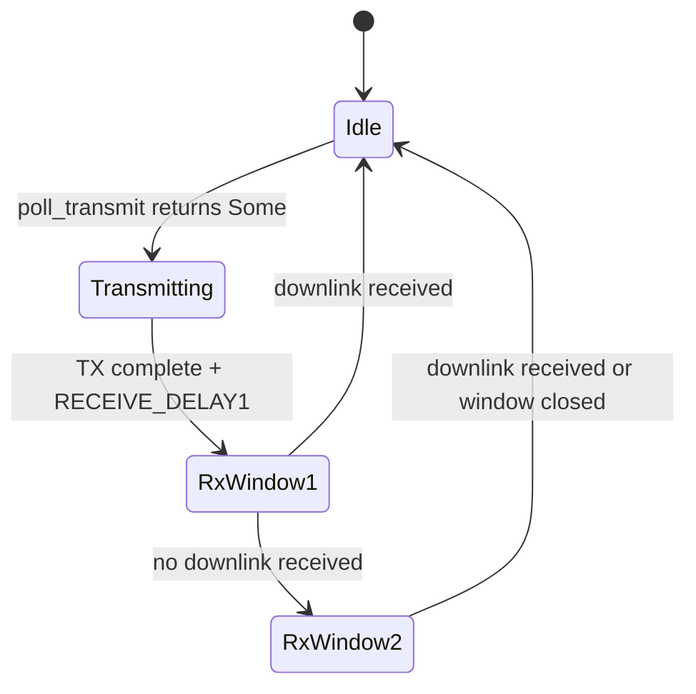

# theatron — Architecture Proposal

## Project Goal

theatron is a simulation framework for evaluating, comparing, and designing MAC-level and above LoRa protocols. The aim is to enable rigorous, reproducible protocol research: implement a protocol once against a common trait interface, run it through a shared simulation engine, and get comparable metrics.

## Evaluation Dimensions

theatron targets multiple dimensions of protocol evaluation:

- **Performance under interference**: throughput vs spreading factor, saturated band scenarios, co-channel contention
- **Parameter optimization**: SF, bandwidth, coding rate, and TX power tradeoffs
- **Scalability**: throughput and latency degradation as node count grows
- **Reliability**: packet delivery ratio, retransmission overhead, join success rate
- **Energy efficiency**: time-on-air as a proxy for battery impact
- **Security and resilience**: adversarial scenarios including replay attacks, jamming, band flooding, and eavesdropping; adversaries may be external or internal (compromised nodes)

## Core Abstractions

### `Protocol` trait

The central abstraction. Each MAC protocol implements this trait, which defines how a node processes received frames, generates transmissions, and manages state.

```rust
trait Protocol {
    type Config;
    type State;
    type Metrics;

    fn init(&self, config: Self::Config) -> Self::State;
    fn on_receive(&self, state: &mut Self::State, frame: RxMetadata, time: SimTime);
    fn poll_transmit(&self, state: &mut Self::State, time: SimTime) -> Option<Transmission>;
    fn update(&self, state: &mut Self::State, time: SimTime);
    fn metrics(&self, state: &Self::State) -> Self::Metrics;
}

struct RxMetadata {
    payload: Vec<u8>,
    rssi: f32,
    snr: f32,
    sf: u8,
    time: SimTime,
}

struct Transmission {
    payload: Vec<u8>,
    sf: u8,
    bandwidth: u32,
    coding_rate: u8,
    frequency: u32,
}
```

`update` drives timer-based state transitions (e.g. RX1/RX2 window opening in LoRaWAN Class A) without requiring an incoming frame.

#### Two integration levels

**Wrapper integration (primary path)**: the protocol impl wraps a real upstream crate, delegating all state machine logic. The theatron `Protocol` trait becomes a thin adapter. This is the correct approach for LoRaWAN Class A/B/C.

**Trait-level reimplementation**: for novel research protocols that have no upstream implementation. theatron provides the scaffolding; the researcher provides the state machine. The typestate pattern (described below) is available for compile-time correctness validation.

#### Static state machine validation for novel protocols

For protocols implemented directly in theatron (not wrappers), the typestate pattern can encode valid state transitions at the type level:

```rust
struct Idle;
struct Transmitting { started: SimTime }
struct RxWindow1 { tx_end: SimTime }

impl Protocol for LoRaWanClassA<Idle> { ... }
impl Protocol for LoRaWanClassA<Transmitting> { ... }
impl Protocol for LoRaWanClassA<RxWindow1> { ... }
```

Invalid transitions become compile errors. For `lorawan-device` wrappers, correctness comes from the upstream crate's own state machine.

#### LoRaWAN Class A state flow (reference)



### lora-rs Ecosystem Integration

theatron integrates with the lora-rs ecosystem rather than reimplementing LoRaWAN:

- **`lorawan`**: frame parsing and creation, MIC verification, MAC command handling. `RxMetadata.payload` and `Transmission.payload` are raw bytes parsed via `lorawan::parser::PhyPayload`.
- **`lorawan-device`**: real Class A/B/C state machine via `nb_device`. theatron drives it by implementing `PhyRxTx` on a `SimulatedRadio` struct that bridges to the simulated channel.
- **`lora-modulation`**: SF, bandwidth, and time-on-air calculations. Used in the channel model and energy-efficiency metrics.

Principle: integrate, don't reimplement. theatron's value is the simulation harness and evaluation infrastructure, not a LoRaWAN stack.

#### SimulatedRadio sketch

```rust
struct SimulatedRadio {
    channel: Arc<Mutex<Channel>>,
    node_id: NodeId,
}

impl PhyRxTx for SimulatedRadio {
    type PhyError = SimRadioError;

    fn tx(&mut self, config: TxConfig, buf: &[u8]) -> nb::Result<u32, Self::PhyError> {
        self.channel.lock().unwrap().transmit(self.node_id, config, buf)
    }

    fn rx(&mut self, config: RxConfig, receiving: &mut [u8]) -> nb::Result<(usize, RxQuality), Self::PhyError> {
        self.channel.lock().unwrap().poll_receive(self.node_id, config, receiving)
    }
}
```

The `lorawan-device` state machine calls `tx` and `rx` on `SimulatedRadio`; theatron's scheduler calls `update` on the protocol wrapper to drive timer-based transitions (RX1/RX2 windows).

### Channel / Medium

A shared simulation object that models the physical LoRa channel: propagation delay, collision detection, RSSI and SNR derivation, SF orthogonality approximation, and time-on-air gating. The channel carries `Vec<u8>` payloads alongside `TxMetadata` (SF, bandwidth, frequency, TX power). Protocols parse the raw bytes via the `lorawan` crate; the channel remains format-agnostic.

All communication flows through the channel — protocols and interference sources do not interact directly.

### Interference Models

Interference sources are first-class simulation participants. They observe the channel subject to the same physical constraints as legitimate nodes and may inject frames or noise. Multiple interference sources can run simultaneously. Each implements an `InterferenceSource` trait.

```rust
trait InterferenceSource {
    fn observe(&mut self, event: &ChannelEvent, time: SimTime);
    fn poll_inject(&mut self, time: SimTime) -> Option<Transmission>;
}
```

Planned interference models:
- **Saturated band**: high-volume legitimate-looking traffic overwhelming the channel
- **Periodic interferer**: burst interference on a regular schedule (models co-channel ISM band users)
- **Co-channel contention**: multiple independent LoRa networks sharing a frequency plan
- **Adversarial replay**: capture and re-transmit valid frames
- **Selective jamming**: targeted interference against specific SFs or node addresses
- **Passive eavesdropper**: traffic analysis without injection

### Metrics collection

A passive observer attached to the simulation that records per-protocol, per-run statistics: throughput (frames/s per SF), PDR, latency distribution, time-on-air, retransmission count, join success rate, and protocol-specific counters. Output in a structured format suitable for statistical comparison across runs.

## Phased Roadmap

### Phase 1 — lorawan integration and baseline simulation

- Discrete-event time model (`SimTime` as a monotonic tick)
- Channel model using `lora-modulation` types: SF orthogonality approximation, collision detection, propagation delay, RSSI/SNR derivation
- `SimulatedRadio` implementing `PhyRxTx`, bridging to the channel
- LoRaWAN Class A wrapper driving `lorawan-device::nb_device`
- Interference models: saturated band, periodic interferer
- Metrics: throughput per SF, PDR, time-on-air
- **Integration test**: SF7–SF12 throughput under clean, saturated, and periodic-interference channel conditions

### Phase 2 — Pure ALOHA baseline and protocol comparison

- Pure ALOHA trait-level implementation as performance baseline
- Multi-protocol simulation: run N protocol instances in the same channel simultaneously
- Comparison output: side-by-side metrics across protocol variants and SF configurations

### Phase 3 — Expanded interference and adversarial models

- Adversarial replay, selective jamming, passive eavesdropper
- Co-channel contention modeling
- Configurable interference intensity and targeting strategy

### Phase 4 — Metrics, parameter sweeps, reporting

- Structured metrics output (JSON/CSV)
- Statistical utilities (mean, CDF, confidence intervals)
- Parameter sweep runner: iterate over SF, bandwidth, node count, interference intensity
- CI integration: regression detection on protocol performance

### Phase 5 — Extended protocol support and static validation tooling

- LoRaWAN Class B and Class C wrappers
- Typestate validation helpers for novel protocol implementations
- Optional report generation and dashboard

## Key Design Decisions (open for discussion)

### Sync vs async

**Proposal: sync.** The simulation engine controls time explicitly — there is no benefit to async here, and async adds complexity. Each node's `poll_transmit` is called by the scheduler in deterministic order. Revisit if we need to model real-time wall-clock behavior.

### Discrete-event vs continuous time

**Proposal: discrete-event.** LoRa symbol timing is discrete at the physical layer. Discrete-event simulation is simpler to reason about, deterministic, and fast. Continuous time adds little value for MAC-level analysis.

### Frame representation

**Concrete: the channel carries `Vec<u8>` + `TxMetadata`.** Protocols use the `lorawan` crate to parse and construct frames. The channel stays format-agnostic; type safety lives at the protocol layer, not the channel layer.

### Interference source visibility

**Proposal: interference sources observe the channel at the physical layer** (pre-collision-resolution), matching real-world RF capability. They cannot inspect node-internal state unless explicitly modeled as compromised nodes.

### Integrate, don't reimplement

**Principle: use lora-rs crates for all LoRaWAN logic.** theatron's value is the simulation harness and evaluation tooling. Reimplementing `lorawan-device` internals would be duplicated effort and would diverge from the real stack. Novel protocol research goes through the `Protocol` trait directly, not through reimplementation of existing standards.

### Randomness

**Proposal: seeded `rand` with explicit `Rng` threading** through all stochastic components. No global RNG. This makes simulations fully reproducible from a seed and enables parallel runs with different seeds.
