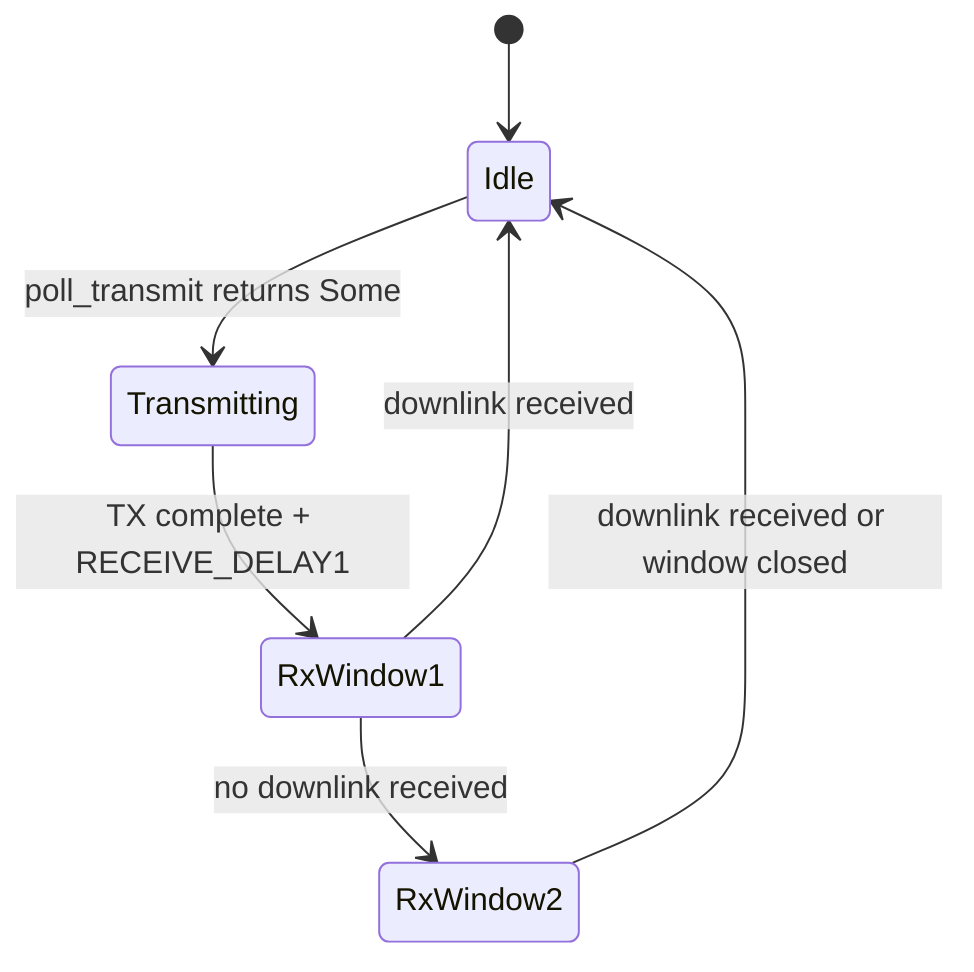

# theatron — Architecture

## Project Goal

theatron is a simulation and evaluation framework that models network-level effects (propagation, interference, contention, adversarial scenarios) to compare protocol implementations under controlled, reproducible conditions. Protocol implementations are external — any `Protocol` trait implementor can be evaluated: different protocols, different implementations of the same protocol, or the same implementation with different parameters. LoRaWAN via lora-rs is the first validation target. Outputs help clients with stack selection and inform protocol development outside theatron.

## Evaluation Dimensions

| Dimension | What is measured |
|---|---|
| Performance under interference | Throughput vs spreading factor, saturated band, co-channel contention |
| Parameter optimization | SF, bandwidth, coding rate, TX power tradeoffs |
| Scalability | Throughput and latency degradation as node count grows |
| Reliability | Packet delivery ratio, retransmission overhead, session establishment (e.g. join success rate) |
| Energy efficiency | Time-on-air as a proxy for battery impact |
| Security and resilience | Replay attacks, jamming, band flooding, eavesdropping; adversaries may be external or compromised nodes |

## Core Abstractions

### `Protocol` trait

The central abstraction. Each MAC protocol implements this trait, defining how a node processes received frames, generates transmissions, and manages state.

```rust
trait Protocol {
    type Config;
    type State;
    type Metrics;

    fn init(&self, config: Self::Config) -> (Self::State, Option<SimTime>);
    fn on_receive(&self, state: &mut Self::State, frame: RxMetadata, time: SimTime) -> Option<SimTime>;
    fn poll_transmit(&self, state: &mut Self::State, time: SimTime) -> Option<Transmission>;
    fn update(&self, state: &mut Self::State, time: SimTime) -> Option<SimTime>;
    fn metrics(&self, state: &Self::State) -> Self::Metrics;
}
```

`init`, `on_receive`, and `update` each return `Option<SimTime>` — the next simulation time at which the scheduler must call `update` on this node. `None` means no pending timer. This enables event-driven dispatch via a priority queue keyed on `SimTime` rather than polling every node every tick.

`update` drives timer-based state transitions (e.g. RX1/RX2 window opening in LoRaWAN Class A) without requiring an incoming frame.

External protocol implementations connect to theatron in one of two ways:

- **Adapter integration**: a thin adapter wraps an external crate (e.g. `lorawan-device`). Protocol logic stays in the external crate; the adapter implements `Protocol` to bridge it into the simulation.
- **Direct trait implementation**: for protocols without an existing crate, implement `Protocol` directly.

For direct implementations, the typestate pattern can encode valid state transitions at the type level, making invalid transitions compile errors:

```rust
struct Idle;
struct Transmitting { started: SimTime }
struct RxWindow1 { tx_end: SimTime }

impl Protocol for MyProtocol<Idle> { ... }
impl Protocol for MyProtocol<Transmitting> { ... }
impl Protocol for MyProtocol<RxWindow1> { ... }
```

For adapter integrations, correctness comes from the upstream crate's own state machine.

#### LoRaWAN Class A state flow (validation target reference)


```mermaid
stateDiagram-v2
    [*] --> Idle
    Idle --> Transmitting : poll_transmit returns Some
    Transmitting --> RxWindow1 : TX complete + RECEIVE_DELAY1
    RxWindow1 --> RxWindow2 : no downlink received
    RxWindow1 --> Idle : downlink received
    RxWindow2 --> Idle : downlink received or window closed
```

### `TrafficModel` trait

LoRaWAN and similar protocols do not transmit autonomously — the application layer decides when to send data. A `TrafficModel` provides uplink payloads when a node is ready to transmit.

```rust
trait TrafficModel {
    fn next_payload(&mut self, time: SimTime) -> Option<Vec<u8>>;
}
```

The scheduler calls `poll_transmit` on the protocol; the protocol (or adapter) calls `next_payload` on the traffic model to get application data. Built-in models: periodic, Poisson arrival, bursty. Custom models can be provided for application-specific load patterns.

### Validation Target: LoRaWAN via lora-rs

The validation example proves the simulation engine works with a real stack. It is external to theatron core and comprises three components:

- **LoRaWAN device adapter**: wraps `lorawan-device::nb_device` to implement the `Protocol` trait
- **Simulated network server**: responds to joins and schedules downlinks
- **SimulatedRadio**: bridges the adapter to theatron's channel

Lora-rs crates used:

| Crate | Role |
|---|---|
| `lorawan` | Frame parsing, MIC verification, MAC command handling. Payloads are raw bytes parsed via `lorawan::parser::PhyPayload`. |
| `lorawan-device` | Real Class A state machine via `nb_device`. Driven by implementing `PhyRxTx` on `SimulatedRadio`. |
| `lora-modulation` | SF, bandwidth, and time-on-air calculations used in the channel model and energy-efficiency metrics. |

#### SimulatedRadio

`lorawan-device`'s `nb_device` exposes an event-driven radio trait (`PhyRxTx`). `SimulatedRadio` implements it to bridge the adapter to the simulated channel.

Key events: `TxRequest(TxConfig, &[u8])`, `RxRequest(RxConfig)`, `CancelRx`, `Phy(PhyEvent)`.
Key responses: `Idle`, `Txing`, `TxDone(ms)`, `Rxing`, `RxDone(RxQuality)`.

`SimulatedRadio` maintains an internal receive buffer and an RX-mode flag. The channel pushes received frames into the buffer when the radio is in RX mode; frames arriving while the radio is not listening are dropped (physically correct behavior).

```rust
struct SimulatedRadio {
    channel: Arc<Mutex<Channel>>,
    node_id: NodeId,
    rx_buf: [u8; 256],
    rx_len: usize,
    mode: RadioMode,  // Idle | Txing { config } | Rxing { config }
}
```

The full `PhyRxTx` implementation lives in the `lorawan_file_transfer` example.

#### Adapter state ownership

`lorawan-device::nb_device::Device<R, RNG, N, D>` bundles the radio, RNG, and MAC state into a single struct. The adapter's `Protocol::State` wraps it with theatron bookkeeping:

```rust
struct LorawanState {
    device: nb_device::Device<SimulatedRadio, Prng, 256, 1>,
    pending_tx: Option<Transmission>,
    next_wake: Option<SimTime>,
}
```

`pending_tx` is populated when the device issues a `TxRequest` through `SimulatedRadio::handle_event`. `next_wake` is updated from `nb_device::Response::TimeoutRequest(ms)` and returned from the adapter's `Protocol` methods as `Option<SimTime>`.

#### Timer contract

`lorawan-device` returns `Response::TimeoutRequest(delay_ms)` when it needs to be woken after a delay (RX1 window, RX2 window, ACK timeout). The adapter converts this to a `SimTime`, returns it from `update`/`on_receive`, and the scheduler delivers `Event::TimeoutFired` at exactly that simulated time.

#### Simulated network server

LoRaWAN requires a server to generate join-accept frames and schedule downlinks. The validation example includes a minimal "perfect server" (zero processing delay):

- Listens for join requests and uplinks
- Derives session keys and generates join-accept frames via `lorawan-encoding`
- Schedules downlink frames into RX1/RX2 windows
- Manages frame counters and DevAddr assignment

The server implements `Protocol` and participates as a node with network-side visibility. It is part of the validation example, not theatron core.

### Channel / Medium

A shared simulation object modeling the physical wireless channel: propagation delay, collision detection, RSSI and SNR derivation, SF orthogonality approximation, and time-on-air gating. The channel model is parameterized; in the validation case it is configured for LoRa using `lora-modulation`. The channel carries `Vec<u8>` payloads alongside `TxMetadata` (SF, bandwidth, frequency, TX power) and remains format-agnostic — protocol adapters parse raw bytes via their respective crates.

All communication flows through the channel; protocols and interference sources do not interact directly.

### Interference Models

Interference sources are first-class simulation participants. They observe the channel subject to the same physical constraints as legitimate nodes and may inject frames or noise.

```rust
trait InterferenceSource {
    fn observe(&mut self, event: &ChannelEvent, time: SimTime);
    fn poll_inject(&mut self, time: SimTime) -> Option<Transmission>;
}
```

Planned models:

| Model | Description |
|---|---|
| Saturated band | High-volume legitimate-looking traffic overwhelming the channel |
| Periodic interferer | Burst interference on a regular schedule (co-channel ISM band users) |
| Co-channel contention | Multiple independent LoRa networks sharing a frequency plan |
| Adversarial replay | Capture and re-transmit valid frames |
| Selective jamming | Targeted interference against specific SFs or node addresses |
| Passive eavesdropper | Traffic analysis without injection |

### Metrics collection

A passive observer recording per-protocol, per-run statistics: throughput (frames/s per SF), PDR, latency distribution, time-on-air, retransmission count, session establishment metrics (e.g. join success rate), and protocol-specific counters. Output in a structured format suitable for statistical comparison across runs.

### Hardware measurement tooling (potential expansion)

To ground simulations in real-world conditions, theatron may include tooling for capturing LoRa hardware characteristics — RSSI profiles, SNR distributions, interference patterns, and timing measurements from physical deployments. These would be uploaded as empirical channel model inputs.

## Phased Roadmap

### Phase 1 — Core simulation engine (validated with LoRaWAN Class A)

- Discrete-event time model (`SimTime` as a microsecond-resolution monotonic `u64`)
- Channel model: parameterized propagation, collision detection, RSSI/SNR derivation
- Simulation scheduler (priority queue on `SimTime`; event-driven dispatch)
- `Protocol` trait, `TrafficModel` trait, and `SimulatedRadio` bridge
- *Validation*: LoRaWAN Class A adapter wrapping `lorawan-device::nb_device`, plus minimal network server — both as external examples
- Interference models: saturated band, periodic interferer
- Metrics: throughput, PDR, time-on-air
- **Integration test**: SF7–SF12 under clean, saturated, and periodic-interference channel conditions

### Phase 2 — Multi-protocol comparison

- Pure ALOHA as trivial reference implementation
- Multi-protocol simulation: run N protocol instances in the same channel simultaneously
- Comparison output: side-by-side metrics across protocol variants and parameterizations

### Phase 3 — Expanded interference and adversarial models

- Adversarial replay, selective jamming, passive eavesdropper
- Co-channel contention modeling
- Configurable interference intensity and targeting strategy

### Phase 4 — Metrics, parameter sweeps, reporting

- Structured metrics output (JSON/CSV)
- Statistical utilities (mean, CDF, confidence intervals)
- Parameter sweep runner: iterate over SF, bandwidth, node count, interference intensity
- CI integration: regression detection on protocol performance

### Phase 5 — Framework generalization and extended tooling

- Parameterizable channel models beyond LoRa
- Hardware measurement tooling: capture real LoRa hardware characteristics for upload as empirical channel model inputs
- Typestate validation helpers for external protocol implementors
- Optional report generation and dashboard

## Key Design Decisions

### Sync vs async

The simulation engine controls time explicitly — there is no benefit to async, and async adds complexity. Each node's `poll_transmit` is called by the scheduler in deterministic order. `lorawan-device::nb_device` is the correct integration target (not `async_device`) for the same reason. Revisit if real-time wall-clock behavior is needed.

### Discrete-event vs continuous time

Wireless symbol timing (e.g. LoRa) is discrete at the physical layer. Discrete-event simulation is simpler to reason about, deterministic, and fast. Continuous time adds little value for MAC-level analysis.

### SimTime resolution

`SimTime` is a microsecond-resolution monotonic `u64`. Microseconds are required for `lora-modulation`'s time-on-air calculations and precise collision detection at high SFs. `lorawan-device`'s `TimestampMs` (`u32` milliseconds) is a subset; conversion is `timestamp_ms = (sim_time / 1_000) as u32`. Symbol times at SF7/125kHz are ~1ms; time-on-air at SF12/125kHz is ~2.5s — both fit comfortably.

### Frame representation

The channel carries `Vec<u8>` + `TxMetadata`. Protocol adapters use their respective crates (e.g. `lorawan`) to parse and construct frames. Type safety lives at the protocol layer, not the channel layer.

### Interference source visibility

Interference sources observe the channel at the physical layer (pre-collision-resolution), matching real-world RF capability. They cannot inspect node-internal state unless explicitly modeled as compromised nodes.

### Protocol logic lives outside theatron

theatron's value is the simulation engine, channel model, and evaluation infrastructure. Protocol implementations — whether adapting existing crates or built from scratch — are external. theatron provides the `Protocol` trait contract and the simulated medium; protocol authors provide the state machines. The lora-rs validation example ships alongside theatron as an example, not as part of the core library.

### Randomness

Seeded `rand` with explicit `Rng` threading through all stochastic components — no global RNG. This makes simulations fully reproducible from a seed and enables parallel runs with different seeds. For the LoRaWAN adapter, `lorawan-device`'s `Prng` (Wyrand-based) is initialized per-node from a per-node seed derived from the master simulation seed.
