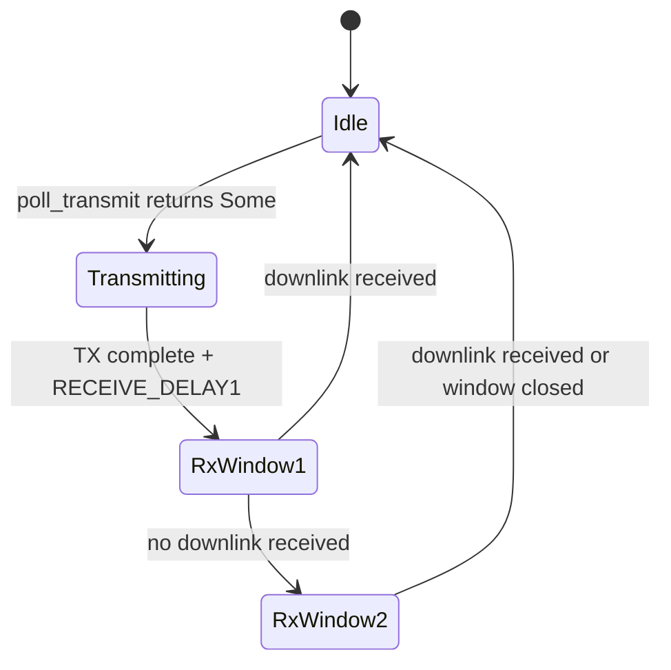

# theatron — architecture proposal

## Project goal

theatron is a simulation and evaluation framework that models network-level effects (propagation, interference, contention, adversarial scenarios) to compare protocol implementations under controlled, reproducible conditions. Any `Protocol` trait implementor can be evaluated — different protocols, different implementations of the same protocol, or the same implementation with different parameters. Protocol implementations live outside theatron (see [Protocol logic lives outside theatron](#protocol-logic-lives-outside-theatron)). LoRaWAN via lora-rs is the first validation target. Outputs inform stack selection and protocol development.

## Evaluation dimensions

theatron targets:

- **Performance under interference**: throughput vs spreading factor, saturated band scenarios, co-channel contention
- **Parameter optimization**: SF, bandwidth, coding rate, and TX power tradeoffs
- **Scalability**: throughput and latency degradation as node count grows
- **Reliability**: packet delivery ratio, retransmission overhead, protocol-specific session establishment metrics (e.g. join success rate in LoRaWAN)
- **Energy efficiency**: time-on-air as a proxy for battery impact
- **Security and resilience**: adversarial scenarios including replay attacks, jamming, band flooding, and eavesdropping; adversaries may be external or internal (compromised nodes)

## Core abstractions

### `Protocol` trait

The central abstraction. Each MAC protocol implements this trait, defining how a node processes received frames, generates transmissions, and manages state.

```rust
trait Protocol {
    type Config;
    type State;
    type Metrics;

    fn init(&self, config: Self::Config) -> (Self::State, Option<SimTime>);
    fn on_receive(&self, state: &mut Self::State, frame: RxMetadata, time: SimTime) -> Option<SimTime>;
    fn poll_transmit(&self, state: &mut Self::State, time: SimTime) -> Option<Transmission>;
    fn update(&self, state: &mut Self::State, time: SimTime) -> Option<SimTime>;
    fn metrics(&self, state: &Self::State) -> Self::Metrics;
}

struct RxMetadata {
    payload: Vec<u8>,
    rssi: f32,
    snr: f32,
    sf: u8,
    time: SimTime,
}

struct Transmission {
    payload: Vec<u8>,
    sf: u8,
    bandwidth: u32,
    coding_rate: u8,
    frequency: u32,
}
```

`init`, `on_receive`, and `update` each return `Option<SimTime>` — the next simulation time at which the scheduler must call `update` on this node. `None` means no pending timer. This enables event-driven dispatch (a priority queue keyed on `SimTime`) instead of per-tick polling.

`update` drives timer-based state transitions (e.g. RX1/RX2 window opening in LoRaWAN Class A) without requiring an incoming frame.

#### Integration patterns

- **Adapter integration**: a thin adapter wraps an external crate (e.g. `lorawan-device`); protocol logic stays in the external crate and the adapter implements `Protocol` to bridge it.
- **Direct trait implementation**: a protocol implemented externally against `Protocol` directly, for protocols without an existing crate.

#### Recommended pattern: typestate state-machine validation

For direct `Protocol` implementations, the typestate pattern encodes valid state transitions at the type level:

```rust
struct Idle;
struct Transmitting { started: SimTime }
struct RxWindow1 { tx_end: SimTime }

impl Protocol for MyProtocol<Idle> { ... }
impl Protocol for MyProtocol<Transmitting> { ... }
impl Protocol for MyProtocol<RxWindow1> { ... }
```

Invalid transitions become compile errors. For adapter integrations, correctness comes from the upstream crate's state machine.

#### LoRaWAN Class A state flow (validation target reference)


```mermaid
stateDiagram-v2
    [*] --> Idle
    Idle --> Transmitting : poll_transmit returns Some
    Transmitting --> RxWindow1 : TX complete + RECEIVE_DELAY1
    RxWindow1 --> RxWindow2 : no downlink received
    RxWindow1 --> Idle : downlink received
    RxWindow2 --> Idle : downlink received or window closed
```

### `TrafficModel` trait

LoRaWAN and similar protocols do not transmit autonomously — the application layer decides when to send. A `TrafficModel` supplies uplink payloads when a node is ready to transmit.

```rust
trait TrafficModel {
    fn next_payload(&mut self, time: SimTime) -> Option<Vec<u8>>;
}
```

The scheduler calls `poll_transmit` on the protocol; the protocol (or its adapter) calls `next_payload` to get application data. Built-in models: periodic, Poisson arrival, bursty. Custom models support application-specific load patterns.

### Validation target: LoRaWAN via lora-rs

LoRaWAN via lora-rs is the first real-world protocol used to validate the simulation engine. The example lives outside theatron core and has three components:

- **LoRaWAN device adapter**: wraps `lorawan-device::nb_device` to implement `Protocol`.
- **Simulated network server**: responds to joins and schedules downlinks (see below).
- **`SimulatedRadio`**: bridges the adapter to theatron's channel.

Crates used:

- **`lorawan`**: frame parsing/creation, MIC verification, MAC command handling. `RxMetadata.payload` and `Transmission.payload` are raw bytes parsed via `lorawan::parser::PhyPayload`.
- **`lorawan-device`**: real Class A state machine via `nb_device`. The adapter drives it by implementing `lorawan_device::nb_device::radio::PhyRxTx` on `SimulatedRadio`.
- **`lora-modulation`**: SF, bandwidth, and time-on-air calculations; used in the channel model and energy-efficiency metrics.

#### `nb_device::radio::PhyRxTx` interface

`lorawan-device`'s `nb_device` module exposes an event-driven radio trait (not polling). `SimulatedRadio` implements it:

```rust
pub trait PhyRxTx {
    type PhyEvent: fmt::Debug;
    type PhyError: fmt::Debug;
    type PhyResponse: fmt::Debug;

    const ANTENNA_GAIN: i8 = 0;
    const MAX_RADIO_POWER: u8;

    fn get_mut_radio(&mut self) -> &mut Self;
    fn get_received_packet(&mut self) -> &mut [u8];
    fn handle_event(
        &mut self,
        event: radio::Event<'_, Self>,
    ) -> Result<radio::Response<Self>, Self::PhyError>
    where
        Self: Sized;
}
```

Events: `TxRequest(TxConfig, &[u8])`, `RxRequest(RxConfig)`, `CancelRx`, `Phy(PhyEvent)`.
Responses: `Idle`, `Txing`, `TxDone(ms)`, `Rxing`, `RxDone(RxQuality)`.

TX flow: `handle_event(TxRequest(...))` → `Txing`, then a later `Phy(...)` event → `TxDone(timestamp_ms)`.
RX flow: `handle_event(RxRequest(...))` → `Rxing`; on frame arrival → `RxDone(quality)`, and the state machine reads bytes via `get_received_packet()`.

#### `SimulatedRadio` sketch

`SimulatedRadio` holds a receive buffer and an RX-mode flag. theatron's channel pushes received frames into the buffer when the radio is in RX mode; frames arriving while not listening are dropped (physically correct).

```rust
struct SimulatedRadio {
    channel: Arc<Mutex<Channel>>,
    node_id: NodeId,
    rx_buf: [u8; 256],
    rx_len: usize,
    mode: RadioMode,
}

enum RadioMode { Idle, Txing { config: TxConfig }, Rxing { config: RxConfig } }

impl PhyRxTx for SimulatedRadio {
    type PhyEvent = SimPhyEvent;
    type PhyError = SimRadioError;
    type PhyResponse = SimPhyResponse;

    const MAX_RADIO_POWER: u8 = 22;

    fn get_mut_radio(&mut self) -> &mut Self { self }

    fn get_received_packet(&mut self) -> &mut [u8] {
        &mut self.rx_buf[..self.rx_len]
    }

    fn handle_event(
        &mut self,
        event: radio::Event<'_, Self>,
    ) -> Result<radio::Response<Self>, Self::PhyError> {
        match event {
            radio::Event::TxRequest(config, buf) => {
                self.mode = RadioMode::Txing { config };
                self.channel.lock().unwrap().enqueue_tx(self.node_id, config, buf);
                Ok(radio::Response::Txing)
            }
            radio::Event::RxRequest(config) => {
                self.mode = RadioMode::Rxing { config };
                Ok(radio::Response::Rxing)
            }
            radio::Event::CancelRx => {
                self.mode = RadioMode::Idle;
                Ok(radio::Response::Idle)
            }
            radio::Event::Phy(SimPhyEvent::TxDone { timestamp_ms }) => {
                self.mode = RadioMode::Idle;
                Ok(radio::Response::TxDone(timestamp_ms))
            }
            radio::Event::Phy(SimPhyEvent::RxDone { quality, payload }) => {
                self.rx_len = payload.len().min(self.rx_buf.len());
                self.rx_buf[..self.rx_len].copy_from_slice(&payload[..self.rx_len]);
                self.mode = RadioMode::Idle;
                Ok(radio::Response::RxDone(quality))
            }
        }
    }
}
```

The `lorawan-device` state machine calls `handle_event` on `SimulatedRadio`; theatron's scheduler delivers simulated radio events (TX completion, RX frame arrival) via `device.handle_event(Event::RadioEvent(phy_event))` on the adapter state.

#### Adapter state ownership

`lorawan-device::nb_device::Device<R, RNG, N>` bundles the radio, RNG, and MAC state. The adapter's `Protocol::State` wraps it with theatron bookkeeping:

```rust
struct LorawanState {
    device: nb_device::Device<SimulatedRadio, Prng, 255>,
    pending_tx: Option<Transmission>,
    pending_timeout_ms: Option<u32>,
    tx_start_time: SimTime,
}
```

`pending_tx` is populated when the device issues `TxRequest` through `SimulatedRadio::handle_event`. `pending_timeout_ms` is updated from `nb_device::Response::TimeoutRequest(ms)`; combined with `tx_start_time`, the adapter converts it to `SimTime` and returns it from `Protocol::on_receive` / `update`. Because `device` lives inside `&mut LorawanState`, mutable access flows through all `Protocol` method signatures.

#### Timer contract

`lorawan-device` returns `Response::TimeoutRequest(delay_ms)` when it needs to be woken after a delay (RX1/RX2 window, ACK timeout). The adapter converts this to `SimTime` and returns it from `update` / `on_receive`. The scheduler enqueues the wake time and calls `update` at exactly that simulated time, which delivers `Event::TimeoutFired` to the device.

#### Simulated network server

LoRaWAN is not peer-to-peer — a server must generate join-accepts and schedule downlinks. The lora-rs example includes a minimal "perfect server" (zero processing delay) alongside the device adapter that:

- Listens on the channel for join requests and uplinks.
- Derives session keys and generates join-accept frames using `lorawan-encoding`.
- Schedules downlink frames into RX1/RX2 windows.
- Manages frame counters and `DevAddr` assignment.

The server implements `Protocol` and participates as a node with network-side visibility. It ships in the lora-rs example, not theatron core (see [Protocol logic lives outside theatron](#protocol-logic-lives-outside-theatron)).

### Channel / medium

Shared object modelling the physical wireless channel: propagation delay, collision detection, RSSI/SNR derivation, SF orthogonality approximation, and time-on-air gating. Parameterized; for validation it is configured for LoRa via `lora-modulation`. The channel carries `Vec<u8>` payloads alongside `Transmission` (SF, bandwidth, frequency, TX power). Protocol adapters parse raw bytes via their respective crates; the channel stays format-agnostic.

All communication flows through the channel — protocols and interference sources do not interact directly.

### Interference models

Interference sources are first-class participants. They observe the channel under the same physical constraints as legitimate nodes and may inject frames or noise. Multiple sources can run concurrently. Each implements `InterferenceSource`:

```rust
trait InterferenceSource {
    fn observe(&mut self, event: &ChannelEvent, time: SimTime);
    fn poll_inject(&mut self, time: SimTime) -> Option<Transmission>;
}
```

Planned models:
- **Saturated band**: high-volume legitimate-looking traffic that overwhelms the channel.
- **Periodic interferer**: burst interference on a regular schedule (models co-channel ISM users).
- **Co-channel contention**: multiple independent LoRa networks sharing a frequency plan.
- **Adversarial replay**: capture and re-transmit valid frames.
- **Selective jamming**: targeted interference against specific SFs or node addresses.
- **Passive eavesdropper**: traffic analysis without injection.

### Metrics collection

A passive observer that records per-protocol, per-run statistics: throughput (frames/s per SF), PDR, latency distribution, time-on-air, retransmission count, session-establishment metrics (e.g. LoRaWAN join success rate), and protocol-specific counters. Output is structured for cross-run statistical comparison.

### Hardware measurement tooling (potential expansion)

To ground simulations in real conditions, theatron may add tooling that captures LoRa hardware characteristics (RSSI profiles, SNR distributions, interference patterns, timing) from physical deployments and uploads them as empirical channel-model inputs.

## Phased roadmap

### Phase 1 — core simulation engine (validated with LoRaWAN Class A)

- Discrete-event time model (`SimTime` as a microsecond-resolution monotonic counter; see [SimTime resolution](#simtime-resolution)).
- Channel model: parameterized propagation, collision detection, RSSI/SNR derivation (configured for LoRa via `lora-modulation`).
- Scheduler: priority queue on `SimTime`, event-driven dispatch via `Option<SimTime>` returns from `Protocol` methods.
- `Protocol` trait, `TrafficModel` trait, and `SimulatedRadio` bridge.
- *Validation*: LoRaWAN Class A adapter wrapping `lorawan-device::nb_device` plus a minimal network server (both external examples).
- Interference: saturated band, periodic interferer.
- Metrics: throughput, PDR, time-on-air.
- **Integration test**: SF7–SF12 under clean, saturated, and periodic-interference conditions.

### Phase 2 — multi-protocol comparison

- Pure ALOHA as a trivial reference implementation.
- Multi-protocol simulation: N protocol instances in the same channel simultaneously.
- Side-by-side metrics across protocol variants and parameterizations.

### Phase 3 — expanded interference and adversarial models

- Adversarial replay, selective jamming, passive eavesdropper.
- Co-channel contention modeling.
- Configurable interference intensity and targeting strategy.

### Phase 4 — metrics, parameter sweeps, reporting

- Structured metrics output (JSON/CSV).
- Statistical utilities (mean, CDF, confidence intervals).
- Parameter-sweep runner over SF, bandwidth, node count, interference intensity.
- CI integration: regression detection on protocol performance.

### Phase 5 — framework generalization and extended tooling

- Parameterizable channel models beyond LoRa.
- Hardware measurement tooling (see above) feeding empirical channel-model inputs.
- Typestate validation helpers for external protocol implementors.
- Optional report generation and dashboard.

## Key design decisions (open for discussion)

### Sync vs async

**Proposal: sync.** The engine controls time explicitly; async adds complexity for no benefit. Each node's `poll_transmit` runs in deterministic scheduler order. `lorawan-device::nb_device` is the correct integration target (not `async_device`). Revisit only if modelling real-time wall-clock behaviour.

### Discrete-event vs continuous time

**Proposal: discrete-event.** Wireless symbol timing (e.g. LoRa) is discrete at the physical layer. Discrete-event simulation is simpler, deterministic, and fast; continuous time adds little for MAC-level analysis.

### SimTime resolution

**`SimTime` is a monotonic `u64` microsecond counter.** Microseconds are required for `lora-modulation`'s time-on-air calculations (which return `u64` microseconds) and for precise collision detection at high SFs. `lorawan-device`'s `TimestampMs` (`u32` ms) is a subset; conversion is `timestamp_ms = (sim_time / 1_000) as u32`. Symbol times at SF7/125kHz are ~1ms; time-on-air at SF12/125kHz is ~2.5s — both fit comfortably in `u64` microseconds.

### Frame representation

**The channel carries `Vec<u8>` + `Transmission`.** Adapters use their crate of choice (e.g. `lorawan`) to parse and construct frames. Type safety lives at the protocol layer, not the channel.

### Interference source visibility

**Interference sources observe the channel at the physical layer** (pre-collision-resolution), matching real-world RF capability. They cannot inspect node-internal state unless explicitly modeled as compromised nodes.

### Protocol logic lives outside theatron

**theatron provides the simulation engine, channel model, and evaluation infrastructure; protocol implementations are external.** The `Protocol` trait contract and the simulated medium come from theatron; state machines come from protocol authors. The lora-rs example (device adapter, network server, `SimulatedRadio`) ships alongside theatron as an example, not as part of the core library.

### Randomness

**Seeded `rand` with explicit `Rng` threading** through all stochastic components; no global RNG. This makes simulations fully reproducible from a seed and enables parallel runs with different seeds. For the LoRaWAN adapter, `lorawan-device`'s Wyrand-based `Prng` is initialized per-node from a per-node seed derived from the master simulation seed.
