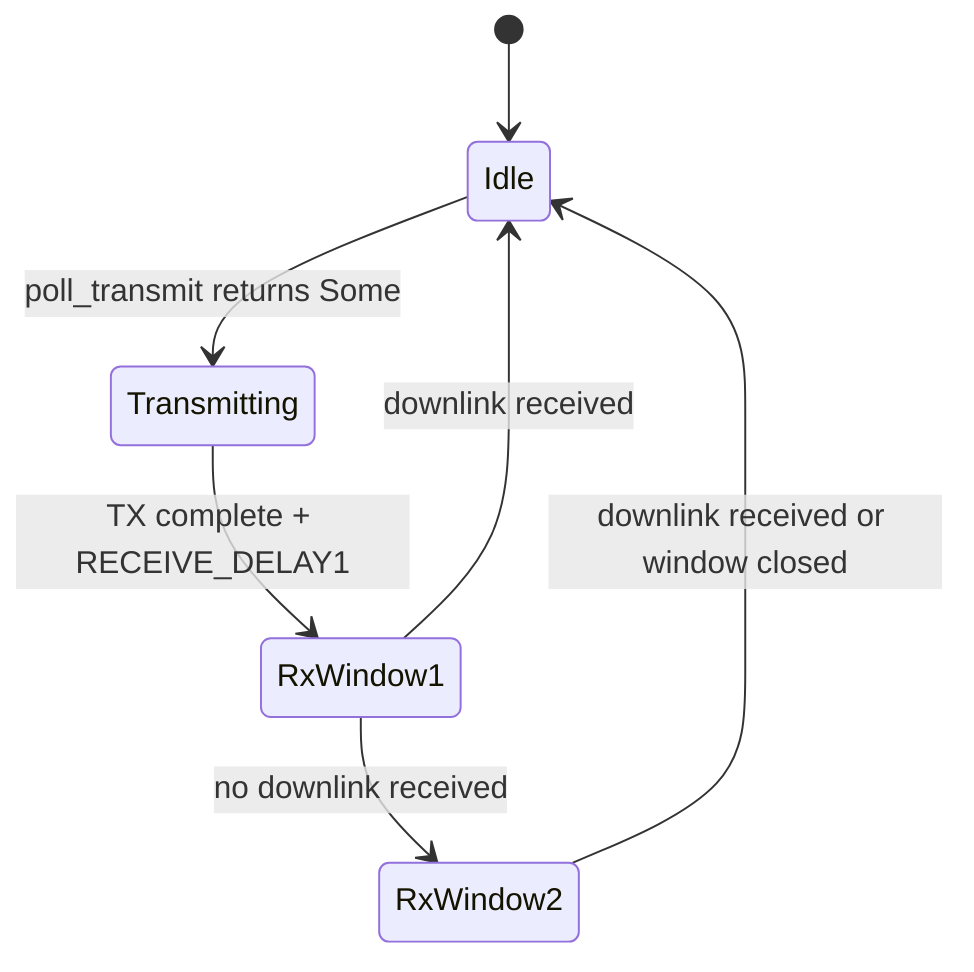

# theatron — Architecture

## Project Goal

theatron is a simulation and evaluation framework that models network-level effects (propagation, interference, contention, adversarial scenarios) to compare protocol implementations under controlled, reproducible conditions. Protocol implementations are external — any `Protocol` trait implementor can be evaluated. LoRaWAN via lora-rs is the first validation target.

## Evaluation Dimensions

- **Performance under interference**: throughput vs spreading factor, saturated band scenarios, co-channel contention
- **Parameter optimization**: SF, bandwidth, coding rate, and TX power tradeoffs
- **Scalability**: throughput and latency degradation as node count grows
- **Reliability**: packet delivery ratio, retransmission overhead, protocol-specific session metrics (e.g. join success rate)
- **Energy efficiency**: time-on-air as a proxy for battery impact
- **Security and resilience**: replay attacks, jamming, band flooding, eavesdropping; adversaries may be external or internal (compromised nodes)

## Core Abstractions

### `Protocol` trait (`src/traits.rs`)

The central abstraction. Each MAC protocol implements this trait to define how a node processes received frames, generates transmissions, and manages state.

`init`, `on_receive`, and `update` each return `Option<SimTime>` — the next time the scheduler must call `update` on this node. `None` means no pending timer. This enables event-driven dispatch via a priority queue rather than polling every node on every tick.

`update` drives timer-based state transitions (e.g. RX1/RX2 window opening in LoRaWAN Class A) without requiring an incoming frame.

#### Connecting external protocol implementations

**Adapter integration**: a thin adapter wraps an external crate (e.g. `lorawan-device`). Protocol logic stays in the external crate; the adapter implements `Protocol` to bridge it into the simulation. See `examples/lorawan_file_transfer/lorawan_adapter.rs`.

**Direct trait implementation**: a protocol implemented externally against `Protocol` directly, for protocols without an existing crate.

#### Typestate pattern for direct implementors

The typestate pattern can encode valid state transitions at the type level, making invalid transitions compile errors:

```rust
struct Idle;
struct Transmitting { started: SimTime }
struct RxWindow1 { tx_end: SimTime }

impl Protocol for MyProtocol<Idle> { ... }
impl Protocol for MyProtocol<Transmitting> { ... }
impl Protocol for MyProtocol<RxWindow1> { ... }
```

For adapter integrations, correctness comes from the upstream crate's own state machine.

#### LoRaWAN Class A state flow (validation target reference)


```mermaid
stateDiagram-v2
    [*] --> Idle
    Idle --> Transmitting : poll_transmit returns Some
    Transmitting --> RxWindow1 : TX complete + RECEIVE_DELAY1
    RxWindow1 --> RxWindow2 : no downlink received
    RxWindow1 --> Idle : downlink received
    RxWindow2 --> Idle : downlink received or window closed
```

### `TrafficModel` trait (`src/traits.rs`)

Provides uplink payloads to a node when it is ready to transmit. The scheduler calls `poll_transmit` on the protocol; the protocol (or adapter) calls `next_payload` on the traffic model to get application data. Built-in models: periodic, Poisson arrival, bursty.

### Validation Target: LoRaWAN via lora-rs (`examples/lorawan_file_transfer/`)

The lora-rs example is external to theatron core and proves the engine works with a real stack. It comprises:

- **`lorawan_adapter.rs`**: wraps `lorawan-device::nb_device` to implement `NodeHandle`
- **`simulated_radio.rs`**: implements `lorawan_device::nb_device::radio::PhyRxTx`, bridging the adapter to theatron's channel
- **`network_server.rs`**: receives uplinks; a minimal server stub (no downlinks in the current example)
- **`periodic_interferer.rs`**: periodic burst interferer implementing `InterferenceSource`

Dependencies used by the example:
- **`lorawan`**: frame parsing, MIC verification, MAC command handling
- **`lorawan-device`**: Class A state machine via `nb_device`
- **`lora-modulation`**: SF, bandwidth, and time-on-air calculations

#### Timer contract

`lorawan-device` returns `Response::TimeoutRequest(delay_ms)` when it needs waking after a delay (RX1 window, RX2 window, ACK timeout). The adapter converts this to `SimTime` and returns it from `update` / `on_receive`. The scheduler inserts the wake time into its event queue and calls `update` at exactly that simulated time, delivering `Event::TimeoutFired` to the device.

### Channel / Medium (`src/channel.rs`)

Models the physical wireless channel: collision detection, RSSI/SNR derivation, SF orthogonality approximation, and time-on-air gating. The channel is format-agnostic — it carries `Vec<u8>` payloads alongside `TxMetadata` (SF, bandwidth, frequency, TX power). Protocol adapters parse raw bytes via their respective crates.

All communication flows through the channel — protocols and interference sources do not interact directly.

### Interference Models (`src/traits.rs` — `InterferenceSource`)

Interference sources are first-class simulation participants subject to the same physical constraints as legitimate nodes. Multiple sources can run simultaneously.

Implemented: periodic interferer. Planned:
- Saturated band, co-channel contention
- Adversarial replay, selective jamming, passive eavesdropper

### Metrics (`src/metrics.rs`)

`MetricsCollector` records per-node and aggregate statistics: TX count, RX count, collisions, captures, and total airtime. Structured output (JSON/CSV) is planned for Phase 4.

### Hardware measurement tooling (potential expansion)

theatron may add tooling to capture real LoRa hardware characteristics (RSSI profiles, interference patterns, timing) for use as empirical channel model inputs.

## Phased Roadmap

| Phase | Focus | Status |
|-------|-------|--------|
| 1 | Core engine + LoRaWAN Class A validation | In progress |
| 2 | Multi-protocol comparison, Pure ALOHA reference | Planned |
| 3 | Adversarial replay, selective jamming, co-channel contention | Planned |
| 4 | Structured metrics output, parameter sweep runner, CI regression detection | Planned |
| 5 | Parameterizable channel models, hardware measurement tooling, report generation | Planned |

## Design Decisions

### Sync, not async

The simulation engine controls time explicitly — async adds complexity with no benefit. `lorawan-device::nb_device` is the correct integration target (not `async_device`) for the same reason.

### Discrete-event time

Wireless symbol timing is discrete at the physical layer. Discrete-event simulation is deterministic and fast; continuous time adds little value for MAC-level analysis.

### SimTime resolution (`src/time.rs`)

`SimTime` is a microsecond-resolution monotonic `u64`. Microseconds are required for `lora-modulation` time-on-air calculations and precise collision detection at high SFs. Conversion to `lorawan-device`'s `TimestampMs` (`u32` milliseconds): `timestamp_ms = (sim_time / 1_000) as u32`.

### Frame representation

The channel carries `Vec<u8>` + `TxMetadata`. Type safety lives at the protocol layer; the channel stays format-agnostic.

### Interference source visibility

Interference sources observe the channel at the physical layer (pre-collision-resolution), matching real-world RF capability. They cannot inspect node-internal state unless explicitly modeled as compromised nodes.

### Protocol logic lives outside theatron

theatron's value is the simulation engine, channel model, and evaluation infrastructure. Protocol implementations are external. theatron provides the `Protocol` trait and simulated medium; protocol authors provide the state machines.

### Randomness

Seeded deterministic RNG with explicit threading through all stochastic components — no global RNG. Simulations are fully reproducible from a seed and support parallel runs with different seeds.
